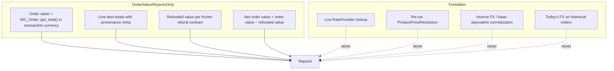

# Multicurrency Reporting — M21 architecture

**Milestone:** 21 · **Target version:** 0.20.0 · **Baseline:** origin/main
`2ec24fabc40252f4dda4dd7445dc8ce19acb5b11` (M20 / v0.19.0 closure)

**ADR:** [`docs/adr/0026-multicurrency-reporting-truth-contract.md`](../adr/0026-multicurrency-reporting-truth-contract.md)

This document materializes the approved M21 plan. Production implementation must
follow this specification. Working drafts under untracked `docs/plans/` are not
source of truth (`ReleaseAuditTest` forbids tracked `docs/plans/`).

---

## 1. Product objective

Give merchants UMC-owned admin reporting that answers, in **native transaction
currency only**:

- How much order value and net order value occurred per currency?
- What share of product-line value used fixed vs converted pricing?
- How many orders came from manual customer selection vs Visitor Location?
- How often did checkout currency fallback occur?

**Primary theme:** Reporting truth — read immutable order facts; never reprice
history.

M21 does **not** integrate with WooCommerce Analytics, normalize to base currency,
or perform live FX during report generation.

---

## 2. Baseline

| Item | Value |
|---|---|
| Prior release | M20 / **v0.19.0** |
| Baseline commit | `2ec24fabc40252f4dda4dd7445dc8ce19acb5b11` |
| Settings schema | **6** (unchanged) |
| Persisted inventory | **9** at baseline → **10** in M21 |
| OrderSnapshot schema | **4** at baseline → **5** in M21 |
| DB migration | None |
| Custom reporting table | None |

---

## 3. Reporting truth contract

```text
Order value      = WC_Order::get_total() for qualifying orders
Refunded value   = RefundValueResolver (frozen: WC_Order::get_total_refunded())
Net order value  = order value − refunded value
AOV              = total order value ÷ qualifying order count (per currency)
```



### Architectural rules (non-negotiable)

1. Report stored transaction-currency amounts only (order-native authority).
2. Pricing-source splits use `_umc_line_price_source` at transaction time
   (provenance authority).
3. `_umc_exchange_rate` is diagnostic/table-only — **no inverse FX** in Phase 1.
4. No live FX during report generation — no `RateProvider`, no `Converter::convert()`
   on historical orders, no `FixedPriceRepository` reads for aggregation.
5. No base-equivalent normalization — `HistoricalAmountNormalizer` is **not in M21**.
6. CSV and admin UI share one aggregation path through immutable report models.

---

## 4. Transaction currency authority

Frozen precedence for monetary currency aggregation:

```text
1. Valid UMC transaction-currency snapshot → _umc_transaction_currency
2. Legacy / no UMC snapshot               → WC_Order::get_currency()
3. Invalid / missing both                 → exclude from monetary aggregation;
                                            classify diagnostically
```

Never substitute the current store base currency for a legacy order.

---

## 5. Legacy order handling

`LegacyOrderClassifier` wraps `OrderSnapshotReader` classification states.

| Class | Criteria | Reporting behaviour |
|---|---|---|
| **Full** | Valid snapshot + expected keys | All applicable reports; currency from rule 1 |
| **Partial** | Snapshot with missing keys | Include in order-value totals when currency resolves; flag in UI |
| **Legacy** | No UMC snapshot | Include using `WC_Order::get_currency()`; provenance/origin = `unknown` |
| **Unresolvable** | Invalid/missing currency authority | Exclude from monetary aggregation; diagnostic bucket |
| **Pre-M20 lines** | No `_umc_line_price_source` | Pricing-source = `unknown` |
| **Pre-M21 / absent origin** | No `_umc_currency_origin` meta | Origin classification = `unknown` |

Snapshot version distinguishes pre-schema-5 orders from M21+ orders where origin
capture failed (meta absent). Never infer `fixed`, `converted`, `customer`, or
`visitor_location` for legacy or absent data.

UI shows a warning when legacy/unknown buckets materially affect totals.

---

## 6. Origin capture authority

At `woocommerce_checkout_create_order` (classic + Store API adapter), `OrderSnapshot`
copies origin **only** from authoritative M15 session provenance
(`umc_currency_origin` / equivalent provenance state). It must **not** independently
determine origin from cookies, Visitor Location heuristics, current currency,
country, or resolver outcome.

| Provenance state at checkout | Persisted `_umc_currency_origin` |
|---|---|
| Manual customer selection | `customer` |
| Visitor Location persistence | `visitor_location` |
| Missing / tampered / invalid | **omit meta** |
| Transaction currency mismatch | **does not write origin** |

```text
Persisted historical fact:  customer | visitor_location | absent
Reporting classification: customer | visitor_location | unknown
```

**Never persist `unknown`.** Reporting maps absent → `unknown` at read time only.

### Required origin tests (WP1 / WP9)

- Manual selection → `customer`
- Visitor Location → `visitor_location`
- Missing provenance → absent meta → reporting `unknown`
- Tampered/invalid provenance → absent meta → reporting `unknown`
- Transaction currency mismatch does not write origin

---

## 7. Order snapshot schema 5

Additive meta only:

| Key | Constant | Values | Since |
|---|---|---|---|
| `_umc_currency_origin` | `OrderSnapshot::META_CURRENCY_ORIGIN` | `customer` \| `visitor_location` | M21 |

Also wire unread M11 fields into `OrderCurrencySnapshot` + reader:

- `_umc_checkout_mode`
- `_umc_shopper_currency`
- `_umc_fallback_occurred`

| Contract | Version |
|---|---|
| `OrderSnapshot::SCHEMA_VERSION` | **5** |
| `Settings::SCHEMA_VERSION` | **6** (unchanged) |
| `PersistedKeys::INVENTORY_VERSION` | **10** |

---

## 8. Refund authority and test matrix

WP0 characterizes WooCommerce refund APIs before WP4 implementation.

**Frozen authority (subject to WP0 confirmation):**
`WC_Order::get_total_refunded()` in parent transaction currency.

`RefundValueResolver` is the single refund entry point for all reports.

### Refund test matrix (WP4 / WP9)

| # | Scenario | Assert |
|---|---|---|
| 1 | No refund | Refunded value = 0; net = order value |
| 2 | Partial refund | Refunded value matches WC; no double-count |
| 3 | Multiple partial refunds | Cumulative = `get_total_refunded()` |
| 4 | Full refund | Refunded value ≈ order value; net ≈ 0 |
| 5 | Refunded order status | Parent in population when status filter includes it |
| 6 | Line/tax/shipping refund components | Single authority; no component double-count |

Guard against double-counting when partial refunds exist alongside line-item
refund records.

---

## 9. Filter scope rules

### Global filters (all reports)

| Filter | Default | Notes |
|---|---|---|
| Date range | Last 30 days | Presets: 7d, 30d, 90d, YTD, custom |
| Order status | `processing`, `completed` | Merchant-configurable |
| Transaction currency | All | Optional narrow |
| Currency origin | All | `customer` / `visitor_location` / `unknown` |
| Fallback | All | yes/no (M11+ orders) |

### Pricing-source filter (Pricing Source report only)

> Applies **only** to the Pricing Source report. Does **not** modify Currency
> Performance, Origin, or Fallback metrics.

- Buckets: `fixed`, `converted`, `unknown`
- Product lines only via `_umc_line_price_source`
- Amount: `line.get_total()` in transaction currency
- Footnote: *"Product lines only."*

---

## 10. Phase 1 reports

| Report | Primary metrics | Data sources |
|---|---|---|
| **Currency Performance** | Order count, order value, refunded value, net order value, AOV | `get_total()`, `RefundValueResolver`, currency precedence |
| **Pricing Source** | Product-line value by `fixed` / `converted` / `unknown` | Line-item meta M20+ |
| **Currency Origin** | Order counts by origin classification | `_umc_currency_origin` or absent → unknown |
| **Checkout Fallback** | Fallback count, shopper vs transaction mismatch | M11 snapshot fields |
| **Rate Provenance** (table-only) | Counts by `_umc_rate_source`, `_umc_rate_provider` | Schema 4+ orders |

**Out of scope:** base normalization, WC Analytics, geographic revenue, transition
reasons, charting library.

---

## 11. Domain model

New namespace `src/Reporting/`:

| Class | Responsibility |
|---|---|
| `ReportingDateRange` | Immutable inclusive date bounds |
| `ReportingQuery` | Filters + range + report type |
| `ReportingQueryHash` | Cache key from all query dimensions + schema version |
| `OrderReportingRepository` | Batched `wc_get_orders( fields => ids )`; HPOS-safe meta_query |
| `OrderReportRecord` | Lightweight per-order facts (currency, totals, flags, classification) |
| `RefundValueResolver` | Single frozen refund authority wrapper |
| `LineItemProvenanceAggregator` | Fixed/converted/unknown product-line sums |
| `LegacyOrderClassifier` | Wraps snapshot reader states for reporting buckets |
| `CurrencyPerformanceReport` | Immutable result: per-currency counts and monetary totals + AOV |
| `PricingSourceReport` | Immutable result: product-line value buckets |
| `OriginReport` | Immutable result: origin classification counts |
| `CheckoutFallbackReport` | Immutable result: fallback and mismatch counts |
| `RateProvenanceReport` | Immutable result: rate source/provider counts (table-only) |
| `ReportingService` | Orchestrator: query → repository → aggregators → report models |
| `ReportingCache` | Transient storage + invalidation hook registration |
| `ReportingCsvRenderer` | Serializes same report models as admin UI |

**Removed from M21:** `HistoricalAmountNormalizer`

Admin wiring:

| Class | Responsibility |
|---|---|
| `ReportingSettingsField` | Read-only Reporting section renderer |
| `Plugin.php` | Register services, cache invalidation hooks, CSV export handler |

---

## 12. Query architecture

```text
ReportingQuery
  → OrderReportingRepository::fetch_order_ids( batch 100–250 )
  → foreach id: OrderReportRecord from snapshot DTO + line meta + RefundValueResolver
  → ReportingAggregator (pure PHP sums into immutable report models)
  → ReportingCache::get_or_compute( ReportingQueryHash )
  → Admin renderer | ReportingCsvRenderer
```

### Scaling rules

- Paginate order IDs; batch size 100–250
- No unbounded `wc_get_orders( -1 )`
- Avoid N+1 full order loads where lightweight meta reads suffice
- Hard cap: refuse unbounded "all time" above ~50k qualifying orders without narrower range
- Manual **Refresh report** bypasses cache
- HPOS: `wc_get_orders()` + meta_query only; no direct `$wpdb` postmeta

### Action Scheduler precompute

Deferred unless WP11 performance guards fail. Default path is on-demand aggregation
with cache.

---

## 13. Cache invalidation

15-minute TTL is acceptable; **stale reports after new orders or refunds are not
intentional**.

### Invalidation hooks (simple, no sophisticated system)

| Event | Action |
|---|---|
| Order created | Invalidate reporting cache |
| Payment complete | Invalidate |
| Status transition affecting report population | Invalidate |
| Refund created | Invalidate |
| Refund deleted | Invalidate |

### Cache key dimensions

```text
date range
order statuses
transaction currency filter
origin filter
fallback filter
pricing source filter (when applicable to report type)
report schema / plugin reporting version
```

Second cached request for identical query must demonstrate materially reduced work
vs cold aggregation (WP11 guard).

---

## 14. Performance guards (WP11)

Architectural guards — not sub-second SLA benchmarks:

| Guard | Requirement |
|---|---|
| Batch size | Enforced upper bound (100–250) |
| Query count | No unbounded order fetches; bounded query count per report run |
| Unbounded all-time | Refused above ~50k without narrower range |
| Fixture ceiling | 10k-order fixture completes within generous CI ceiling |
| Cache hit | Second identical request shows reduced work vs cold path |
| Live FX | WP10 guard: no `RateProvider` / `Converter::convert()` on reporting path |
| Product meta | WP10 guard: no `FixedPriceRepository` on reporting path |
| Inverse FX | WP10 guard: no base-equivalent helpers |

---

## 15. Admin UX

New section in `SettingsPage::get_sections()`: **Reporting** (read-only).

Uses `AdminComponentRenderer` statistics grid + widefat tables. Capability:
`manage_woocommerce`.

### Layout

```text
┌─────────────────────────────────────────────────────────────┐
│ Reporting                                                    │
│ [Date preset ▼] [Status ▼] [Currency ▼] [Origin ▼] [Refresh]│
├─────────────────────────────────────────────────────────────┤
│ Statistics cards:                                            │
│   Orders | Net order value | Active currencies | Fixed share │
├─────────────────────────────────────────────────────────────┤
│ Table: Order value by currency                               │
│ Table: Orders by currency                                    │
│ Table: Pricing source (product lines only)                   │
│ Table: Currency origin                                       │
│ Table: Checkout fallback summary                             │
│ Table: Rate provenance (secondary)                           │
├─────────────────────────────────────────────────────────────┤
│ [Export CSV]  Warning banner if legacy/unknown buckets       │
│ Empty state when zero qualifying orders                      │
└─────────────────────────────────────────────────────────────┘
```

- **No charting library**
- Fixed-price share = % of classified product-line value that is `fixed`
- Warning when legacy/unknown buckets present
- Export CSV uses same models as on-screen aggregates

---

## 16. CSV export

```text
ReportingQuery → ReportingService → immutable report models
                                        ├── Admin renderer
                                        └── ReportingCsvRenderer
```

- Nonce-protected admin action
- Aggregate rows only — no per-order PII in Phase 1
- Same query limits and caps as UI
- No second aggregation path

---

## 17. Checkout-transition reporting limits

| Field | Supported use |
|---|---|
| `_umc_fallback_occurred` | Fallback yes/no counts |
| `_umc_shopper_currency` vs transaction currency | Mismatch detection (M11+) |
| `_umc_checkout_mode` | Display in fallback summary context |

| Not supported | Reason |
|---|---|
| Transition reason codes | Not persisted |
| Gateway attribution | Do not infer |
| Geographic revenue | Deferred |

---

## 18. Explicit non-goals

See ADR-0026. No base normalization, WC Analytics integration, geographic
revenue, BI builder, REST write APIs, custom DB tables, per-order CSV PII,
Action Scheduler precompute (by default), or charting.

---

## 19. Persistence versions (M21)

| Contract | Version |
|---|---|
| `Settings::SCHEMA_VERSION` | 6 (unchanged) |
| `PersistedKeys::INVENTORY_VERSION` | 10 |
| `OrderSnapshot::SCHEMA_VERSION` | 5 |

Update [`docs/PERSISTED_DATA.md`](../PERSISTED_DATA.md) during WP1/WP12.

---

## 20. Work packages

| WP | Deliverable |
|---|---|
| **WP0** | ADR-0026 + this spec + ROADMAP + WC refund API characterization + frozen refund authority (**docs-only freeze gate**) |
| **WP1** | OrderSnapshot schema 5; origin capture; reader/DTO for M11 + M21 |
| **WP2** | Reporting domain models + truth-contract unit tests |
| **WP3** | `OrderReportingRepository` + batch aggregation |
| **WP4** | `RefundValueResolver` + refund test matrix |
| **WP5** | `LineItemProvenanceAggregator` + filter-scope tests |
| **WP6** | `ReportingService` + cache + invalidation hooks |
| **WP7** | Admin Reporting section UI |
| **WP8** | `ReportingCsvRenderer` (same models as UI) |
| **WP9** | Integration tests: HPOS, refunds, legacy, filters, permissions, origin |
| **WP10** | Architecture guards: no live FX, no product meta, no inverse FX |
| **WP11** | Performance guards: batches, query limits, 10k ceiling, cache hit |
| **WP12** | Release prep **v0.20.0** — stop at PR boundary |

---

## 21. Test strategy summary

**Unit:** aggregators, classifiers, query hash, CSV parity, origin write rules,
refund resolver.

**Integration:** fixed/converted/mixed carts, multi-currency, full refund matrix,
legacy/partial snapshots, legacy currency from `WC_Order::get_currency()`,
unresolvable exclusion, pre-M20 lines, pre-M21 absent origin, date/status filters,
pricing-source filter scope, HPOS, permissions.

**Guards (WP10):** no `RateProvider`, no `Converter::convert()` live path, no
`FixedPriceRepository`, no inverse-FX helpers on reporting code paths.

**Performance (WP11):** bounded batch size, bounded query count, no
`wc_get_orders(-1)`, 10k fixture CI ceiling, cached second request reduced work.

---

## 22. Risks and stop gates

| Risk | Mitigation |
|---|---|
| Refund double-count | WP0 characterization + test matrix |
| Origin reconstructed from currency | Capture authority + tests |
| CSV/UI drift | Single report model path |
| Cache staleness | Invalidation hooks |
| Perf CI flakiness | Architectural guards, not sub-second SLA |

**Stop gates:** WP0 approved → production; refund authority frozen before WP4;
guard failure → no tag.

**Acceptance:** order value/net by currency; fixed vs converted from line provenance;
origin persisted facts + absent → unknown; fallback from M11 only; no live FX; CSV
matches UI; schema 5 + PersistedKeys 10 documented; settings schema 6; release audit
PASS at v0.20.0.
