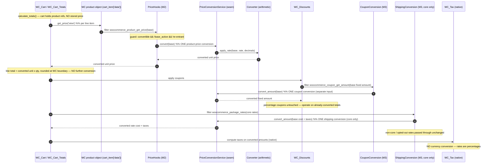

# Transaction flow — how money is converted (and converted only once)

This document traces a base-currency amount through the cart, coupons, shipping,
taxes, checkout and the order, and proves that no amount is ever converted twice.
It is the reference for Milestone 3 (classic cart & checkout). Order display,
emails, refunds and Blocks/Store API are later milestones and are not covered
here.

## The model: unit-price-authoritative conversion

Milestone 2 converts the **product unit price** in `view` context through one
seam — `Integration\PriceConversionService`, backed by `Converter`. Milestone 3
keeps that as the **single** product-price converter and feeds WooCommerce's own
totals engine. WooCommerce then computes line totals, discounts, shipping, fees
and taxes natively, in the selected currency, from those already-converted unit
prices.

M3 adds conversion **only** for the monetary inputs M2 never touched:

- **fixed coupon amounts** and **coupon min/max thresholds** (`CouponConversion`),
- **core shipping costs** (`ShippingConversion`, core methods only).

It converts **nothing else**. In particular:

- **Taxes are never converted.** Tax rates are currency-agnostic percentages;
  WooCommerce computes tax natively on the converted amounts.
- **Fees are not converted** in M3 (disabled by decision; opt-in only).
- The cart stores **product references, not prices**, so every recalculation
  reconverts from the base price — a converted value is never reused as input.
- M3 **never calls `set_price()`** on a cart item, so a converted price is never
  written back and re-read.

## Why there is no double conversion

Each monetary value crosses the seam **at most once**, and the converters operate
on **disjoint inputs**:

| Input | Authored in | Converted by | Where |
|---|---|---|---|
| Product unit price | base | `PriceHooks` → seam (M2) | `woocommerce_product_get_*` (view) |
| Fixed coupon amount / thresholds | base | `CouponConversion` → seam | `woocommerce_coupon_get_*` |
| Core shipping cost + taxes | base | `ShippingConversion` → seam | `woocommerce_package_rates` |
| Percentage coupon | — (percent) | not converted | operates on converted totals |
| Line/cart taxes | — (percent) | not converted | `WC_Tax`, native |

A product price is only ever read through the M2 view getters, and only
`CouponConversion`/`ShippingConversion` (never the product path) touch coupon and
shipping inputs. `PriceHooks` additionally holds a re-entrancy guard that blocks
any nested conversion. The result: a converted store rounds identically to a
native store priced in that currency (ADR-0002 / ADR-0004).

## Sequence — one conversion per amount

## Currency switch and cache identity

The cart never persists a converted price, so switching currency and
recalculating always reconverts from base. What can go stale is WooCommerce's
*cached* totals and shipping rates. Both are keyed by the **rate identity** —
`CurrencyContext::get_currency_signature()` = `code:rate` (e.g. `SEK:11.50`):

- `CartRecalculation` stamps the cart session with the identity and forces one
  recalculation when it changes (switch, rate edit, stale/cross-tab session).
- `ShippingConversion` injects the identity into each shipping package so the
  `shipping_for_package_*` cache is currency-specific.

Because the identity includes the **rate**, an admin rate edit invalidates caches
even when the currency code is unchanged.

## Checkout and the order

On classic checkout the active currency drives `get_woocommerce_currency()` (M2's
`woocommerce_currency` filter), so WooCommerce natively:

- sets the order currency to the active code, and
- copies the active-currency cart totals into the order lines.

`OrderSnapshot` then writes an immutable audit snapshot (base currency,
transaction currency, exact rate, timestamp, source, plugin version, rate
identity) via `WC_Order` CRUD — once, at `woocommerce_checkout_create_order`. The
snapshot is never overwritten, so later store-rate changes cannot alter a
historical order. See ADR-0004.
